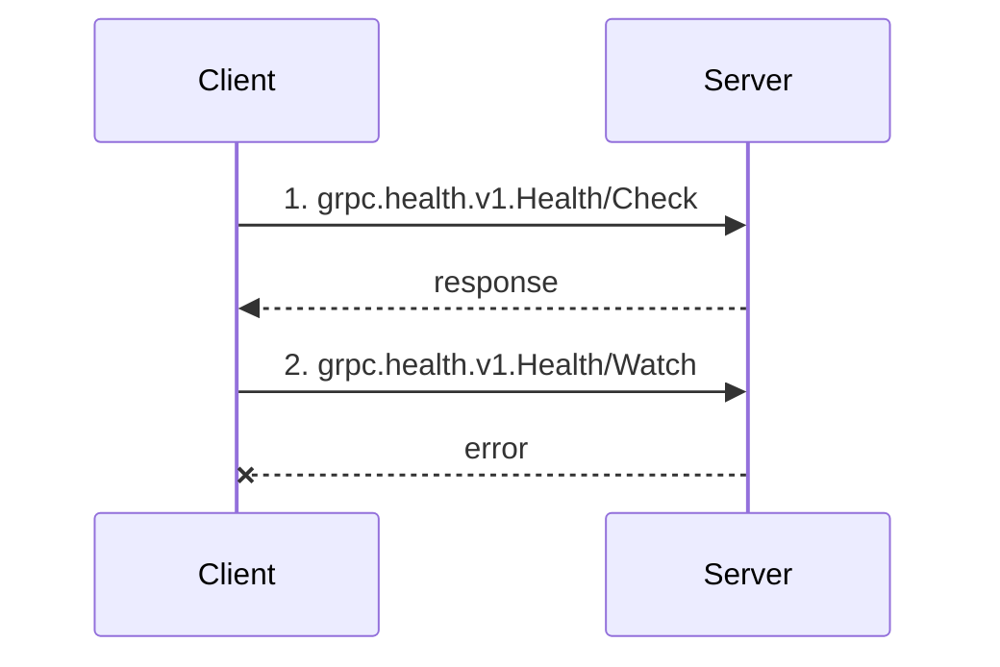
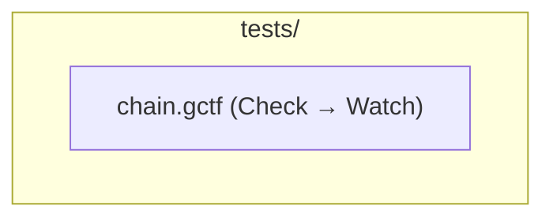

# Command Line Interface

Reference for the Rust CLI.

## Synopsis

```bash
grpctestify [OPTIONS] [TEST_PATHS]... [COMMAND]
```

## Quick workflow

- If no subcommand is provided, `grpctestify` runs tests using the provided paths
- `run` is available explicitly, but optional for normal usage
- Global flags apply to commands (`-v`, `--completion`)
- Typical flow: `check` -> `run` -> report flags in CI

## Precedence quick map

- `run` mode runtime keys: `section attributes > OPTIONS > CLI runtime baseline/defaults`
- `bench` mode profile keys: `CLI bench flags > BENCH section > bench defaults`
- Address/TLS/compression also involve env fallbacks; see [OPTIONS](../sections/options) and [BENCH](../sections/bench).

## Naming migration note

- Runtime option/attribute canonical naming is snake_case (`retry_delay`, `no_retry`, `#[retry_delay]`, `#[no_retry]`).

## Commands

- `run [TEST_PATHS]...` - run tests (default command)
- `bench [TEST_PATHS]...` - run load benchmark mode for `.gctf` scenarios
- `bench-compare <BASELINE> <CURRENT>` - compare two bench JSON reports and gate on regressions
- `check <FILES...>` - validate `.gctf` syntax and semantic rules
- `fmt <FILES...>` - format `.gctf` files
- `inspect <FILE>` - inspect parsed file structure (`text` or `json`)
- `explain <FILE>` - show execution explanation (`text` or `json`); multi-document chains also get a Mermaid sequence diagram
- `graph [PATHS...]` - visualize directory-fixture topology (`_setup`/tests/`_teardown`) as a text tree or Mermaid flowchart
- `list [PATH]` - list discovered tests for tooling and IDE integration
- `reflect [SYMBOL]` - list reflected services and methods from a target server
- `grpcurl <FILE>` - generate a `grpcurl` invocation from an existing `.gctf` file
- `call <FILE>` - call gRPC endpoint without assertions (or inline: `call -e <pkg.Service/Method> -d '<json>'`, no file needed)
- `health <ADDRESS>` - check gRPC service health
- `lsp` - start language server protocol mode
- `index <SOURCES...>` - build/rebuild data source indexes
- `query [FILES...]` - interactive shell or CLI query for data sources
- `gen grpcurl [--execute] <grpcurl-args>` - generate a `.gctf` file from a grpcurl invocation
- `play` - launch the web UI playground (proto reflection, saved requests, history, environments)
- `scaffold --endpoint <SERVICE/METHOD>` - generate a runnable `.gctf` test from a proto file, descriptor, or server reflection

## Global options

- `-v, --verbose` - verbose output
- `NO_COLOR` env var - disable colorized output (no dedicated CLI flag)
- `--completion <SHELL_TYPE>` - install shell completion (`bash`, `zsh`, `fish`, `elvish`, `powershell`)

## Run options

- `--exclude <PATTERN>` - exclude files/directories by glob (repeatable)
- `--tags <TAGS>` - include only tests containing all provided tags (from `META.tags`)
- `--skip-tags <TAGS>` - exclude tests containing any provided tags (from `META.tags`)
- `-p, --parallel <N|auto>` - parallel workers (`auto` by default)
- `-d, --dry-run` - print execution plan without running requests
- `-s, --sort <TYPE>` - sort discovered test files (default `path`)
- `--log-format <FORMAT>` - file report format (`json`, `junit`, `allure`, `yaml`, `html`)
- `--log-output <OUTPUT_FILE>` - output path for file report
- `--stream` - emit streaming JSON events for integration
- `-t, --timeout <SECONDS>` - per-test timeout (default `30`)
- `-r, --retry <COUNT>` - retry count for failed network calls (default `0`)
- `--retry-delay <SECONDS>` - initial retry delay (default `1`)
- `--no-retry` - disable retry mechanisms completely
- `--progress <MODE>` - progress mode (`auto`, `dots`, `bar`, `none`)
- `--no-assert` - skip assertion evaluation and print raw responses
- `--coverage` - generate API coverage report
- `--coverage-format <text|json|html>` - coverage output format
- `-w, --write` - write actual server responses back to test files (snapshot mode)

Note: if `--log-format` is set without `--log-output`, the run continues and file report generation is skipped with a warning.

## Subcommand options

- `fmt`: `-w, --write` rewrites files in place (without `-w`, checks formatting)
- `check`: `--format <text|json>`
- `inspect`: `--format <text|json>`
- `explain`: `--format <text|json>`, `--against <REPORT_JSON>` (post-hoc: correlate against a prior `run --log-format json` report — shows actual per-assertion pass/fail + timing instead of just the static plan)
- `graph`: `--format <text|mermaid>`
- `list`: `--format <text|json>`, `--with-range`
- `reflect`: `--address <ADDR>`, `--plaintext`, `--insecure`, `--format <text|json>`,
  `--list-methods`, `--describe <SERVICE/METHOD>`,
  `--tls-ca <FILE>`, `--tls-cert <FILE>`, `--tls-key <FILE>`
- `lsp`: `--stdio`
- `call`: `-e <pkg.Service/Method>` + `-d '<json>'` (inline call with no file), `--insecure`, `--plaintext`, `--tls-ca <FILE>`, `--tls-cert <FILE>`, `--tls-key <FILE>` (TLS flags override the file's TLS section, and are the sole TLS source in inline `-e` mode), `--bench`, `--concurrency <N>`, `--requests <N>`, `--duration <DURATION>`
- `health`: `--service <NAME>`, `--format <text|json>`, `--tls`, `--insecure`, `--timeout <SECONDS>`
- `scaffold`: `--endpoint <SERVICE/METHOD>`, `--proto <FILE_OR_DIR>`, `--descriptor <FILE>`, `--reflect`, `--address <ADDR>`, `--tls`, `--insecure`, `--plaintext`
- `bench` (selected):
  - stop conditions: `-n, --requests`, `-d, --duration`, `--max-duration`
  - load profile: `--max-rps`, `--load-schedule`, `--load-start`, `--load-step`, `--load-end`, `--load-step-duration`, `--load-max-duration`
  - methodology: `--warmup`, `--ramp-up`, `--duration-stop`, `--skip-first`, `--count-errors-in-latency`, `--latency-percentiles`
  - runtime/transport: `-c, --concurrency`, `--connections`, `--connect-timeout`, `--keepalive`, `--cpus`
  - validation/progress: `--assert-mode`, `--no-assert`, `--sample-rate`, `--progress-interval`
  - profiles: `--profile <name>`, `--list-profiles`, `--profile-file <path>` (see [BENCH § Profiles](../sections/bench#profiles))
  - metadata/output: `--name`, `--log-format` (`console`/`json`/`csv`/`ndjson`/`prometheus`), `--output`, `--allure-output-dir <dir>` (emits the shared `allure-results` contract — one result per benchmarked endpoint — plus a raw `benchmark-report.json`)

## Bench examples

```bash
# Constant profile for 60 seconds
grpctestify bench tests/ --duration 60s --concurrency 16 --max-rps 200

# Step profile (ghz-style)
grpctestify bench tests/ \
  --duration 40s \
  --load-schedule step \
  --load-start 50 \
  --load-step 10 \
  --load-end 150 \
  --load-step-duration 5s

# Use BENCH section defaults, override progress heartbeat
grpctestify bench tests/ --progress-interval 2s
```

`reflect --plaintext` expects `http://...` or `host:port` addresses. It is rejected for explicit `https://...` addresses. `reflect --insecure` forces skip-verify even for an explicit `https://` address (a bare `host:port` already skips verification by default).

`health`/`scaffold --tls` requests a verified TLS connection — without it, `health` and `scaffold --reflect` connect in plaintext by default (TLS-with-skip-verify only via `--insecure`).

## Explain and graph examples

`explain` on a multi-document chain leads with a `FLOW` summary (step, endpoint, expectation kind) plus a fenced Mermaid sequence diagram — paste either straight into a markdown file and GitHub/VitePress render it natively:

```bash
grpctestify explain tests/chain.gctf
```



`graph` visualizes directory-fixture topology (`_setup.gctf` → sibling tests → `_teardown.gctf`) across a whole directory:

```bash
grpctestify graph tests/ --format mermaid
```



## Health

```bash
# Check overall server health
grpctestify health localhost:50051

# Check specific service
grpctestify health localhost:50051 --service my.Service

# JSON output
grpctestify health localhost:50051 --format json

# Skip TLS verification
grpctestify health localhost:50051 --insecure

# Verified TLS connection
grpctestify health localhost:50051 --tls
```

## Call with --bench

```bash
# Run a test file as benchmark
grpctestify call test.gctf --bench --concurrency 10 --requests 1000

# Skip TLS verification
grpctestify call test.gctf --insecure
```

## Reflect

`reflect`'s positional argument is a service symbol or `service/method` symbol — not a `.gctf` file, and not the address. Pass the server address via `--address` (or `$GRPCTESTIFY_ADDRESS`).

```bash
# List all methods with signatures
grpctestify reflect --address localhost:50051 --list-methods

# Describe a specific method
grpctestify reflect --address localhost:50051 --describe my.Service/Method

# JSON output
grpctestify reflect --address localhost:50051 --format json

# TLS client certificate
grpctestify reflect --address localhost:50051 --tls-cert client.pem --tls-key client.key
```

## List

List discovered `.gctf` test files. Intended for tooling and IDE integration;
the default output is JSON.

```bash
grpctestify list [PATH] [--format <text|json>] [--with-range]
```

Flags:

- `PATH` - file or directory to scan (optional; defaults to the current directory)
- `--format <text|json>` - output format (default `json`)
- `--with-range` - include per-test source range information (line spans)

```bash
# List tests under a directory as JSON with source ranges
grpctestify list tests/ --with-range
```

## Grpcurl

Generate an equivalent `grpcurl` invocation from an existing `.gctf` file. Useful
for reproducing a test call manually or in a shell script.

```bash
grpctestify grpcurl <FILE> [--doc-index <N>] [--format <text|json>]
```

Flags:

- `FILE` - `.gctf` file to convert (required)
- `--doc-index <N>` - document index for multi-document `.gctf` files (1-based)
- `--format <text|json>` - output format (default `text`)

```bash
# Print the grpcurl command for a test file
grpctestify grpcurl tests/user/get_user.gctf
```

## Gen

Generate a `.gctf` file from an external invocation. The source is selected by a
sub-subcommand; currently `grpcurl` is supported.

```bash
grpctestify gen [-o <OUTPUT>] grpcurl [-e|--execute] <grpcurl-args>...
```

Flags:

- `-o, --output <OUTPUT>` - write the generated `.gctf` to a file (stdout if omitted)
- `grpcurl <grpcurl-args>...` - the grpcurl arguments to translate (required;
  hyphen-prefixed flags are passed through verbatim)
- `-e, --execute` - run the grpcurl invocation and append the captured
  `RESPONSE`/`ERROR` section to the generated file

```bash
# Convert a grpcurl call into a .gctf file, executing it to capture the response
grpctestify gen -o get_user.gctf grpcurl -e -plaintext \
  -d '{"id":"1"}' localhost:4770 user.UserService/GetUser
```

## Examples

```bash
# Run a single test
grpctestify test.gctf

# Run a directory in parallel
grpctestify tests/ --parallel 4

# Run explicit command form
grpctestify run tests/

# Create JUnit report
grpctestify tests/ --log-format junit --log-output test-results.xml

# Stream JSON events for integrations
grpctestify tests/ --stream

# Use include/exclude filtering
grpctestify tests/ --exclude "tests/legacy/**" --tags smoke --skip-tags flaky

# Validate files
grpctestify check tests/**/*.gctf

# Reflect one method signature
grpctestify reflect user.UserService/GetUser --address localhost:50051

# Format files in-place
grpctestify fmt -w .

# Check formatting (non-zero exit if changes are needed)
grpctestify fmt .

# Reflect all methods
grpctestify reflect --list-methods --address localhost:50051

# Health check
grpctestify health localhost:50051 --service my.Service
```

## Fmt behavior

- `grpctestify fmt <files...>` works as a formatting check and exits with code `1` if any file needs reformatting.
- `grpctestify fmt -w <files...>` rewrites files in place.
- Safe optimizer rewrites are applied by default.
- For CI, run both `fmt` and `check`.

## See Also

- [Test File Format](./test-files)
- [Installation](../../getting-started/installation)
